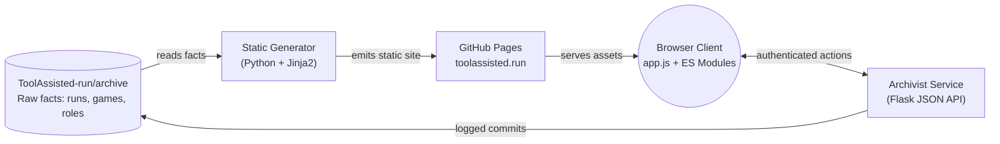

<div align="center">

# toolAssisted.run: website

**The official repository for the [toolAssisted.run](https://toolassisted.run) web platform.**  
*An open, community-driven archive dedicated to preserving tool-assisted speedruns, score attacks, and superplays.*

[](https://github.com/ToolAssisted-run/website/actions/workflows/deploy.yml)
[](https://toolassisted.run)
[](https://forum.toolassisted.run)
[](https://github.com/ToolAssisted-run/archive)
[](https://discord.gg/VsKDT9XB6u)
[](LICENSE)

</div>

---

> [!IMPORTANT]
> **Archival comes first; curation emerges from the community afterwards.**  
> Every verifiable work is preserved the moment it arrives, and merit is decided in the open by the people who care about it. [The community constitution](https://github.com/ToolAssisted-run/.github/blob/main/profile/README.md) outranks every implementation choice: when code and constitution disagree, the code is wrong.

---

## Overview

This repository powers [toolAssisted.run](https://toolassisted.run). The platform is divided into two programs sharing one single source of truth:

1. **The Static Site Generator** (`generator/`): A fast Python and Jinja2 generator that ingests facts from the [archive repository](https://github.com/ToolAssisted-run/archive), computes derivations (rankings, points, verification states), and renders the static site published to GitHub Pages.
2. **The Archivist Service** (`archivist/`): A lightweight Flask application running on the community server. It manages intake, member authentication via forum SSO, reviews, and git-backed updates with public audit logging.



> [!NOTE]
> **Design Record**: [`DESIGN.md`](DESIGN.md) is the canonical living snapshot of the site's rationale and decisions. It is continuously maintained to describe the present state rather than serving as a changelog. For code structure, consult [`ARCHITECTURE.md`](ARCHITECTURE.md).

---

## Repository Structure

| Path | Component | Description |
|---|---|---|
| [`generator/`](generator/) | Model & Generator | Reads archive facts, computes derivations (rankings, states), and compiles Jinja2 templates into static HTML. |
| [`archivist/`](archivist/) | Archivist Service | Flask API backend handling authentication, submission intakes, expert edits, and git-backed logs. |
| [`assets/`](assets/) | Frontend Runtime | Modular ES scripts (`app.js`, `page-*.js`) and stylesheets (`style.css`). Shipped directly with zero bundler friction. |
| [`tests/`](tests/) | Hermetic Test Suites | Rigorous test suites covering movie parsers, generator invariants, security policies, and layout fidelity. |
| [`infra/`](infra/) | Infrastructure | Discourse forum themes, server configurations, and operational scripts. |
| [`tools/`](tools/) | Utilities | Automation and diagnostic tools (zap, validation helpers, benchmarks). |

---

## Features and Invariants

- [x] **Zero Server-Side Emulation**: Emulation is never executed server-side. Encodes and movie files are preserved, verified, and reproduced through transparent community workflows.
- [x] **Decoupled Architecture**: Frontend and backend communicate only through static JSON blobs embedded on pages and authenticated REST calls to the archivist API.
- [x] **Auditability and Integrity**: Member content is modified only by responsible experts inside their jurisdiction, with every change logged in `edits.json` and traceable in git history.
- [x] **Universal Verification**: One verification from any community member marks a run as verified; an expert can invalidate a flawed verification if needed.
- [x] **Privacy and Independence**: No third-party analytics, tracking scripts, or ad networks.

---

## Development Guide

<details>
<summary><b>Local Development Server</b></summary>

### Prerequisites
- Python 3.10 or newer
- Git checkout of [`ToolAssisted-run/archive`](https://github.com/ToolAssisted-run/archive) (placed in `~/ToolAssisted-archive` or next to this repository)

### Quick Start

Run the integrated development server:

```bash
# Start server as site-wide expert 'GMP'
python serve.py

# Automatically rebuild the site before starting
python serve.py --rebuild

# Start with a specific archive path
python serve.py --archive-dir ../ToolAssisted-archive

# Test different member permissions
python serve.py --user eien86
python serve.py --logged-out
```

> [!TIP]
> `serve.py` includes a built-in mock archivist API, so you can test expert tools, category creation, and run inspection locally without requiring remote server access.

</details>

<details>
<summary><b>Running Hermetic Tests</b></summary>

All tests are hermetic: they run against temporary synthetic fixtures, mock all external services, and never touch real archive data.

```bash
# Movie file parser tests
python tests/test_movieparse.py

# Derivation and ranking parity tests
python tests/test_derivation.py

# Markup preview and wikitext tests
python tests/test_preview_parity.py
python tests/test_wikitext.py

# Output invariant tests (requires archive checkout or fixture)
python tests/test_output.py ../ToolAssisted-archive

# Archivist service end-to-end suite
python tests/test_archivist.py
```

</details>

<details>
<summary><b>Deployment Process</b></summary>

- **Continuous Deployment**: Pushes to the `main` branch trigger the [Build and deploy](.github/workflows/deploy.yml) workflow, which validates tests, generates static pages, and deploys to **GitHub Pages**.
- **Content Synchronization**: When new runs or edits land in the archive repository, a workflow dispatch initiates a site rebuild so the live site always matches the archive.

</details>

---

## Community & Resources

- **Website**: [toolassisted.run](https://toolassisted.run)
- **Forum**: [forum.toolassisted.run](https://forum.toolassisted.run)
- **Constitution**: [Governance & Principles](https://github.com/ToolAssisted-run/.github/blob/main/profile/README.md)
- **Archive**: [ToolAssisted-run/archive](https://github.com/ToolAssisted-run/archive)
- **Discord**: [Join the Discord Community](https://discord.gg/VsKDT9XB6u)

---

## License

- **Code**: Licensed under the [MIT License](LICENSE).
- **Archive Content**: Licensed under [Creative Commons Attribution 4.0 International (CC BY 4.0)](https://creativecommons.org/licenses/by/4.0/) (see the archive repository).
